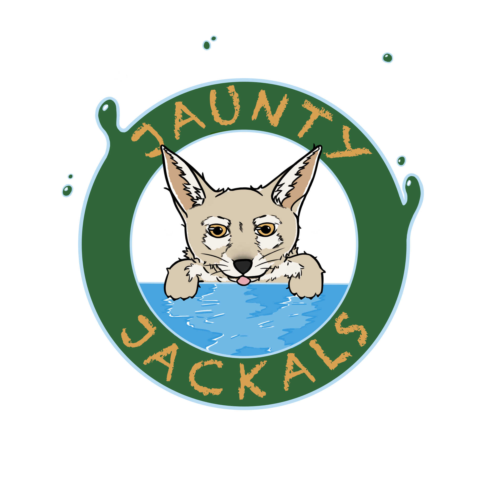

# Jaunty Jackals 2021 Summer Code Jam Repository

---

<div style="text-align: center;">



</div>

Work in progress!

## Requirements

- Python 3.9.5+
- Functional speakers

## Installation

---

### 1. Clone the repository

```shell
git clone https://github.com/Jaunty-Jackals/jaunty-jackals.git
```

### 2. Install requirements

a. Linux
```shell
pip install -r requirements/dev-requirements.txt
```

b. Windows
```shell
pip install -r requirements/windows.txt
```

c. MacOS
```shell
pip install -r requirements/macos.txt
```


## Team

---

- [ponte-vecchio](https://github.com/ponte-vecchio) (Lead) - Repository management,
  UI/UX & colours, macOS & Linux tester

- [NoblySP](https://github.com/NoblySP) - Battleship, Windows10 tester

- [vguo2037](https://github.com/vguo2037) - ConnectFour, macOS tester

- [aphkyle](https://github.com/aphkyle) - Snake, Windows10 tester

- [sapgan](https://github.com/sapgan) - Minesweeper, Linux tester

- [edwin10151](https://github.com/edwin10151) - 2048, Windows10 tester

## Asset Credits

---

- Shane Iveson (Logo)
- Juhani Junkala (Menu sound effects)
- BoxCat Games (Menu music)
